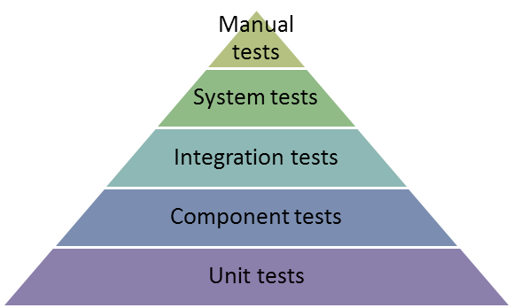
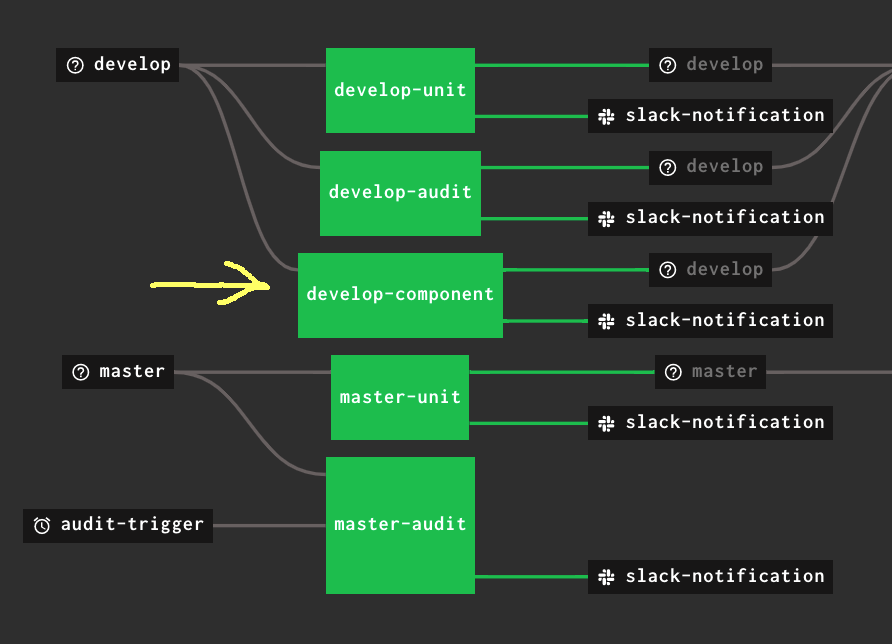

# Introduction

The component testing that is being added uses the Godog/cucumber BDD test framework.

The **Godog/cucumber** framework helps us to write tests in a human readable way.

The dp-component-test library helps us to wrap the application in such a way as to mock out calls to external services like mongodb or auth’ / identity service … or any service the application might interact with.

Component testing is higher up in the test pyramid compared to unit tests.
Unit tests cover every possible path for a unit of code and these are fast to run and relatively easy to write.
Component tests are slower to run and can be more complex.
Component tests do not attempt to check every path but instead they exercise the expected behaviours of the application.



## Purpose of Component Testing

Using these mocked out services allows us to assert that given inputs into the application result in outputs to/from the mocked out services that we are expecting.

Component testing with Cucumber provides a living set of documentation for your application (within the features folder).
The tests will provide explanation of the different features that your application provides, and will also show some test cases for the non happy paths.

## Glossary

**Component** is the application under test.

A **feature** is a behaviour of a component (your application, eg. I can do a GET request to read some data from mongo).

**Steps** folder contains code needed to setup the application into the test environment. It also contains code for specific steps that you might need to add/write for your application (if they do not exist in the component test library).

## Additional Information

For technical details of Godog, see: https://github.com/cucumber/godog
and read its README.md

See also:
https://semaphoreci.com/community/tutorials/how-to-use-godog-for-behavior-driven-development-in-go

https://docs.behat.org/en/v2.5/guides/1.gherkin.html

If you use **vscode**, to help writing your component tests that are expressed in gherkin, you may wish to install the market place extension:


# Example: Adding Component Testing to dp-topic-api

The general purpose of component testing dp-topic-api is to exercise its API endpoints, such that the inputs generate the expected outputs for both public and private modes of operation

## Requirements

Your application **`MUST`** be structured in such a way to allow the injection of dependencies into your application.
That means it needs to have the structure similar to what is in dp-topic-api which has a function call tree of:

```go
func main() {
    run()
}
func run() {
    // get config
    // create service
    // Run services
    // Run the service
    svc := service.New(cfg, svcList)
    if err := svc.Run(ctx, BuildTime, GitCommit, Version, svcErrors); err != nil {
        return errors.Wrap(err, "running service failed")
    }

    // etc
}
func Run() {
}
```

Whereby the service.New method takes a list of services that are instantiated from methods on an interface{}, so that the interface can be mocked etc.

## Adding initial files to your project

For **dp-topic-api** project, in its root folder:

1. Do

```shell
go get github.com/ONSdigital/dp-component-test
```

to add the library to **go.sum** and **go.mod** files in **dp-topic-api**

2. Create a main_test.go file in project at its root (it MUST be in root).

3. Copy the contents of dp-component-test/examples/api/main_test.go into this file.

4. At root of project, create directory called: **`features`**

5. **`cd`** into features and create another directory called: **`steps`**

6. Inside we will create a file to hold the setup code for component testing called: **`<myapp>_component.go`**
for example, for **`dp-topic-api`** we will call it: **`topic_component.go`**

There are examples of mocked out initalisers in dp-dataset-api and dp-observation-importer.

We will copy the contents of **`dp-dataset-api/features/steps/dataset_component.go`** (dated 2021-03-01 feature/refactor-pagination) to into **`topic_component.go`** and adjust it to suit the dp-topic-api.

The function NewTopicComponent() is where you set up the services that and application to be able to run the tests with things like: authorization, database.

You also, in  NewTopicComponent() would set up any mocks, such as: kafka (producers and consumers), non mongo databases (Neo4j or Neptune).

Please see the file **`topic_component.go`** before and after the changes to determine suitable changes for your application. (dated 2021-03-16 @11:25, description: Tailor component test to topic api)

NOTE: In **`NewTopicComponent()`** a line has been added:

```go
f.Config.EnablePrivateEndpoints = false // for component tests, ensure 'false' to start
```

to ensure the default mode for the component tests is “public” (change this if your app should be default “private”).

Add the following into the Makefile:

```text
.PHONY: test-component
test-component:
go test -race -cover -coverprofile="coverage.txt" -coverpkg=github.com/ONSdigital/dp-topic-api/... -component
```

Copy the contents of dp-dataset-api/main_test.go into **`main_test.go`**

(this now over-ride what was done earlier)

Make adjustments for code to work and run with:

```shell
make test-component
```

(this will, at the first run, download mongodb binary)

`Code checked in with description: “Tailor component test to topic api” on 16th March 2021 @11:25AM`

NOTE: `<name>.feature` files are run in alphabetical order. If there are any failures in the tests, they are output where in the sequence of tests they occur and also summarised at the end. (move to a better place).

## Debugging component tests

If you wish to debug the component tests in your **`Ide`**, see this line in main_test.go

```go
// *componentFlag = true // put this line in if you want to "debug test" this function in vscode IDE
```

## Add our first component test
### Component Test #1 – GET /topics in public

NOTE in the feature test files, for the purpose of this documentation and cross-referencing, tests are identified in square brackets, thus:
**`Scenario: [Test #1] GET /topics/unknown in default public mode`**

Normally when you do your tests you should not be using test number and the above line would then look like:
**`Scenario: GET /topics/unknown in default public mode`**

**`(the typical sequence is):`**

1. Add a feature file that will contain the tests for our first feature
2. Add a scenario in this file to test the features
3. Add **`steps.go`** file and copy necessary functions from **`dp-dataset-api/dataset_component.go`** and adjust for topics api
4. NOTE: We are introducing a new gherkin step that Godog will run called: **`“I have these topics”`**. The code for this step is implemented in stems.go in the function: **`iHaveTheseTopics()`** and this function specifies that the document in question is put into the topics collection.

NOTE the topics api at this moment does not write to the collections, it ONLY reads …
Thus in the topic struct we have a line:

**SubtopicIds []string `bson:"subtopics_ids,omitempty" json:"-"`**

So to proceed with component tests the component test code needs to write to the IN MEMORY mongodb, and thus we will need to add two new model structures to allow all fields in the structure to be written to mongodb.

These new struct’s are called: **`TopicWrite`**

and: **`TopicW`**

and are used in **`steps.go`** file.

This first component test does:
Behaviour of application when doing the GET /topics endpoint, using a stripped down version of the database.

`See check in: @ ~ 16:00 on 16th March 2021`

### Component Test #2 - GET /topics in private

Add the section in topics.feature starting with:

**Scenario: GET /topics in private mode**

by copying the previous feature test for the public mode.

Move code into steps.go (from topic_component.go) to set the private endpoint flag to true for this string **`“private endpoints are enabled”`**, see: **`privateEndpointsAreEnabled()`**

Then do:

```shell
make test-component
```

which will fail because we need to adjust the ‘response’ described in the feature.
See the code that is checked in @~12:15 on 17th March 2020 for this test.

NOTE: the code copied from dp-dataset-api already provides authentication.

To run all of the tests in one feature file, for example, do:

```shell
go test -race -cover -coverprofile="coverage.txt" -coverpkg=github.com/ONSdigital/dp-topic-api/... -component features/topics.feature
```

To run a **`single`** test within a feature file, add the specific line number that that test starts on … as in:

```shell
go test -race -cover -coverprofile="coverage.txt" -coverpkg=github.com/ONSdigital/dp-topic-api/... -component features/topics.feature:74
```

to run the: **`“Scenario: GET /topics in private mode”`**

### Component Test #3 - GET /topics/economy in public

See code in **`topic_id.feature`** as checked in ~@ 13:15 on 18th March 2021

To see the code coverage, use command:

```shell
go tool cover -html=coverage.txt
```

### Component Test #4 - GET /topics/unknown in public

The purpose of this test is to demonstrate error handling and **`code coverage`** (before and after the fact) that is not covered with unit testing.

Before running this test, if you run just the previous test with:

```shell
go test -race -cover -coverprofile="coverage.txt" -coverpkg=github.com/ONSdigital/dp-topic-api/... -component features/topic_id.feature:3
```

You can open the resulting coverage file in browser with:

```shell
go tool cover -html=coverage.txt
```

for a black background.

**or to have a white’ish background for putting in this or other documents, do:**

```shell
go tool cover -html=coverage.txt -o c.html
sed "s/black/rgb(248,248,248)/g" c.html >c3.html
open c3.html
```

**to see its code coverage**:


Then run all the tests in **`topics_id.feature`** with:

```shell
go test -race -cover -coverprofile="coverage.txt" -coverpkg=github.com/ONSdigital/dp-topic-api/... -component features/topic_id.feature
```

and then open the new coverage file in another browser window with:

```shell
go tool cover -html=coverage.txt
```

The code coverage should now have increased and the ‘ErrNotFound’ (circled in yellow) is no longer red and the code coverage has increased to 30.8% (circled in red):


`See code in topic_id.feature as checked in ~@ 13:44 on 18th March 2021`

### Component Test #5 - GET /topics/economy in private

`See code in topic_id.feature as checked in ~@ 9:25 on 19th March 2021`

### Component Test #6 - GET /topics/{id}/subtopics in public mode

### Component Test #7 - GET /topics/{id}/subtopics in private mode

`See code in topic_id_subtopics.feature as checked in ~@ 9:45 on 19th March 2021`

### Component Test #8 - GET /topics/{id}/content in public mode

We will create a new step and its functions to write to the content collection, namely functions:

**`iHaveTheseContents()`** and **`putContentInDatabase()`** in steps.go

And we will need to register the function **`iHaveTheseContents()`** in the **`RegisterSteps()`** function.

This test is minimal and gets just one “spotlight”.

`See code in topic_id_content.feature as checked in ~@ 11:15 on 19th March 2021`

### Component Test #9 - GET /topics/{id}/content in private mode

`See code in topic_id_content.feature as checked in ~@ 12:20 on 19th March 2021`

### Component Test #10 - GET /topics/{id}/content?type=articles in public mode

The unit tests fully cover all type possibilities, so here we will only get the articles from a content document that has both articles and bulletins for demonstration purposes.

### Component Test #11 - GET /topics/{id}/content?type=buletins in private mode

Here we will only get the bulletins from a content document that has both articles and bulletins.

`See code in topic_id_content_query.feature as checked in ~@ 12:42 on 19th March 2021`

### Bump Component Test #11 to  Test #12

Use **gherkin** keyword `Background` to set up database for use in two Scenarios and make new Test #11 do query for bulletins.

`See code in topic_id_content_query.feature as checked in ~@ 09:42 on 21th March 2021`

### Component Test #13 - GET /topics/{id}/content in public mode

This test has a topic document added with an “id” of “missingcontent” that does not have a corresponding document in the content collection.

Before this test was added and run, all the other tests were first run and then this:

```shell
go tool cover -func=coverage.txt | grep "GetContent"
```

reported:

```text
github.com/ONSdigital/dp-topic-api/mongo/topic_store.go:106:  GetContent  90.3%
```

Then after adding this test and running all tests again, doing:

```shell
go tool cover -func=coverage.txt | grep "GetContent"
```

reported:

```text
github.com/ONSdigital/dp-topic-api/mongo/topic_store.go:106:  GetContent  96.8%
```

### Component Test #14 - GET /topics/{id}/content?type=bad in public mode

This test queries and unknown content type.

This Component test is not strictly needed as it is covered in the unit tests, but is done to demonstrate code coverage of code that overlaps with unit testing and the time it takes to run component tests.

All 14 of these tests took 7.6 Seconds, whereas the unit tests with a clean cache also take ~6 seconds to run hundreds of tests and are significantly faster when only working on one test and running the test for that.

The code coverage that is being diff’ed here is in the function: **`getContentPublicHandler`**

Before this test was added and run, all the other tests were first run and then this:

```shell
go tool cover -func=coverage.txt | grep "getContentPublicHandler"
```

reported:

```text
github.com/ONSdigital/dp-topic-api/api/content.go:14:  getContentPublicHandler  65.4%
```

Then after adding this test and running all tests again, doing:

```shell
go tool cover -func=coverage.txt | grep "getContentPublicHandler"
```

reported:

```text
github.com/ONSdigital/dp-topic-api/api/content.go:14:  getContentPublicHandler  73.1%
```

`For Test #13 and #14 see code in topic_id_content_query.feature as checked in ~@ 17:45 on 21th March 2021`

### Component Test #15 - GET /topics/nocontent/content in public mode

This test has a topic document added with an “id” of “nocontent” that does not have a content collection.

This does not improve code coverage, but confirms code correct operation if the content collection was to disappear.

`For Test #15 see code in topic_no_content_collection.feature as checked in ~@ 8:38 on 22nd March 2021`

## Add Component Tests to CI pipeline

1. Add ci files: `ci/component.yml` and `ci/scripts/component.sh`
(ensure `chmod 755 component.sh`)
View their contents.

2. Add: to .gitignore file (that is in project root):

```text
# Exclude coverage file
coverage.txt
```

`See code as checked in ~@ 12:43 on 22nd March 2021`

3. Switch the pipeline type to the new one that includes component tests (in `dp-configs/manifests`), that is change “type: nomad-job” to “type: nomad-**`pipeline`**” (as a new feature branch: feature/dp-topic-api-component-pipeline).

`See code as checked in ~@ 12:40 on 22nd March 2021`

4. To complete the move from nomad-job to nomad-pipeline, do the following:

    in:

    ```text
    dp-ci/pipelines/pipeline-generator
    ```

    BUT first, if you do not have `fly` installed - On: https://concourse.onsdigital.co.uk/

    Download concourse's `fly` program by clicking on apple icon:

    

    The picture is at the bottom RHS of the page (on the footer, so make sure the folder is showing)
    
    You’ll then need to add that file to your path somewhere, for example:

    ```shell
    mv ~/Downloads/fly ~/bin
    chmod +x ~/bin/fly
    ```

    For the newest mac OS version, you need to allow the App to run from System Preferences->Security & Privacy->General->Allow Anyway  (for the indicated "fly" App).

    WARNING: in the following make sure you type **`PIPELINE=`** correctly, otherwise it will update all pipelines
    do:

    ```shell
    make bootstrap PIPELINE=dp-topic-api
    ```

    To get:

    

    If you get the following sort of error from the above:

    ```text
    gpg -d secrets.yml.asc > secrets.yml
    gpg: encrypted with 2048-bit RSA key, ID 5FF4333E6C27001E, created 2017-02-09
          "ons-concourse"
    fly -t dp-ci sp -p pipeline-generator -c pipeline.yml -l secrets.yml -n
    error: unknown target: dp-ci
    make: *** [set-generator] Error 1
    ```

    You need to run the following and try again:

    ```shell
    fly --target dp-ci login --team-name main --concourse-url https://concourse.onsdigital.co.uk
    ```

    And follow the instructions in what the above outputs.

    (this creates a `.flyrc` file in your home folder that has a target for `dp-ci`)

    The `make bootstrap` command takes less than a minute to run and in concourse you should see the new `develop-component`, thus:

    

    Then click on develop-component then on the top right hand side, click refresh symbol to run the pipeline.
    
    

    For more information on how the task is running, or has run, click task: component to show the trace:
    
    

    This should all happen in less than 5 minutes, depending on how large your test is.
